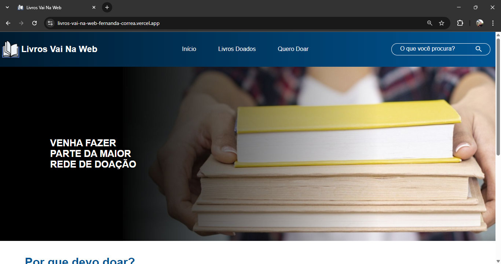

# Api de Doação de Livros VnW

Esta é uma API simples feita com Flask e SQLite para fins de estudo na escola Vai Na Web, que permite cadastrar e listar os livros doados.

## Como rodar o projeto

1. Faça o clone do repositório
```bash
git clone <LINK_DO_REPOSITORIO>
cd nome-do-projeto
```

2. Crie um ambiente virtual (Obrigatório):
```bash
python -m venv venv
source venv/Scripts/activate
```

3. Instale as dependências:
```bash
pip install -r requirements.txt
```

4. Inicie o servidor:
```bash
python app.py
```

> A API estará disponível em http://127.0.0.1:5000/

---

## Endpoints

### POST /doar

O endpoint /doar é utilizado para cadastrar um novo livro em nossa API.

**Envio informações (JSON):**
```json
{
    "titulo":"Ainda estou devendo aqui",
    "categoria":"Finanças",
    "autor":"Fernando Polia",
    "image_url":"https://exemplo.com"
}
```

**Resposta (201):**
```json
{
    "mensagem":"Livro cadastrado com sucesso!"
}
```

---

### GET /livros

O endpoint /livros retorna todos os livros cadastrados na API.

**Resposta (200):**
```json
{
    "id":"1",
    "titulo":"Ainda estou devendo aqui",
    "categoria":"Finanças",
    "autor":"Fernando Polia",
    "image_url":"https://exemplo.com"
}
```

---


